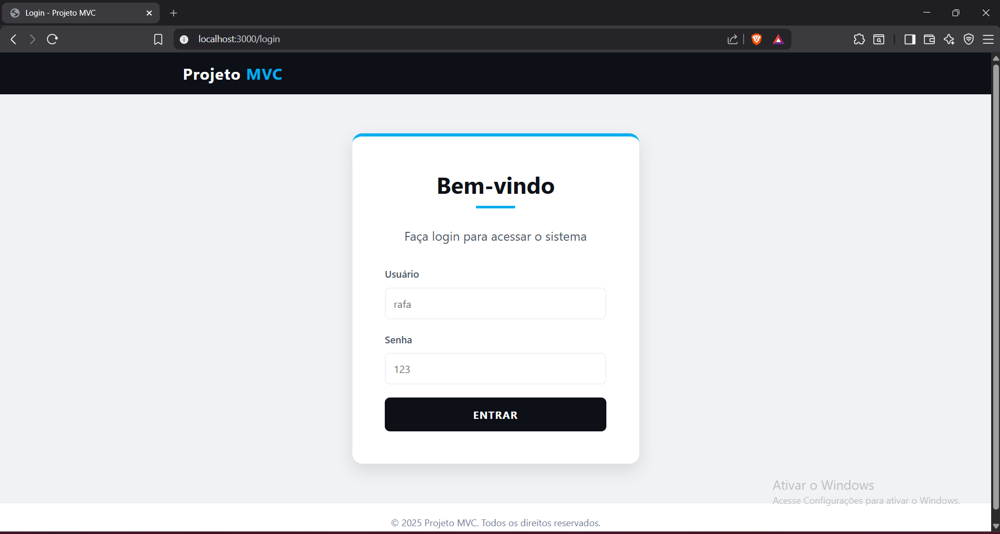
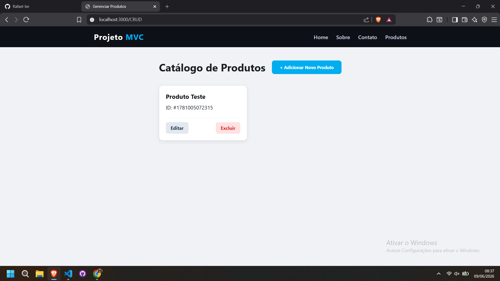

# Projeto MVC - Catalogo de Produtos


Aplicacao web desenvolvida com arquitetura MVC para gerenciar um catalogo simples de produtos. O projeto demonstra autenticacao por sessao, rotas protegidas e operacoes de CRUD usando Node.js, Express e templates EJS.

## Stack Tecnologica

- **Node.js**: ambiente de execucao JavaScript no backend.
- **Express**: framework para criacao do servidor e gerenciamento de rotas.
- **EJS**: engine de templates para renderizacao das paginas.
- **Express Session**: controle de sessao do usuario autenticado.
- **Body Parser / Express JSON**: leitura de dados enviados por formularios e requisicoes.
- **CSS**: estilizacao das paginas da aplicacao.
- **JavaScript**: controle dos modais de criacao e edicao de produtos.

## Funcionalidades

- Login com validacao de usuario e senha.
- Controle de sessao com expiracao configurada.
- Middleware de autenticacao para proteger as paginas internas.
- Pagina inicial de apresentacao do projeto.
- Pagina "Sobre" com descricao da arquitetura e objetivo da aplicacao.
- Pagina "Contato" com formulario visual e simulacao de envio.
- CRUD de produtos:
  - Cadastro de novos produtos.
  - Listagem dos produtos cadastrados.
  - Edicao do nome de um produto.
  - Exclusao de produtos.
- Interface com navegacao entre Home, Sobre, Contato e Produtos.

## Demonstracao Visual

> Adicione as imagens na pasta `public/screenshots` e atualize os caminhos abaixo quando tirar as capturas.

Sugestoes de screenshots para valorizar o projeto:

1. **Tela de Login**
   - Pagina: `http://localhost:3000/login`
   - Mostrar o formulario de autenticacao.
   - Nome sugerido: `public/screenshots/login.png`

2. **Home**
   - Pagina: `http://localhost:3000/`
   - Mostrar a tela inicial com o card principal e o botao de acesso ao gerenciamento.
   - Nome sugerido: `public/screenshots/home.png`

3. **Catalogo de Produtos**
   - Pagina: `http://localhost:3000/CRUD`
   - Mostrar alguns produtos cadastrados, com botoes de editar e excluir.
   - Nome sugerido: `public/screenshots/catalogo-produtos.png`

4. **Modal de Cadastro ou Edicao**
   - Pagina: `http://localhost:3000/CRUD`
   - Abrir o modal de adicionar ou editar produto antes de tirar o print.
   - Nome sugerido: `public/screenshots/modal-produto.png`

Exemplo de como incluir as imagens no README:

```md


```

## Pre-requisitos

Antes de comecar, voce precisa ter instalado:

- [Node.js](https://nodejs.org/)
- npm, instalado junto com o Node.js

## Como Rodar Localmente

Clone o repositorio:

```bash
git clone <url-do-repositorio>
```

Acesse a pasta do projeto:

```bash
cd MVC
```

Instale as dependencias:

```bash
npm install
```

Inicie o servidor:

```bash
node server.js
```

A aplicacao ficara disponivel em:

```text
http://localhost:3000
```

## Credenciais de Acesso

Use o usuario de demonstracao cadastrado no model:

```text
Usuario: rafa
Senha: 123
```

## Variaveis de Ambiente e Configuracao

Atualmente o projeto nao possui arquivo `.env`. As configuracoes principais estao definidas diretamente no arquivo `server.js`:

- Porta da aplicacao: `3000`
- Chave da sessao: `chave_secreta_faculdade`
- Tempo de expiracao do cookie: `1 hora`

Para uma configuracao mais segura e flexivel, voce pode criar futuramente um arquivo `.env` com:

```env
PORT=3000
SESSION_SECRET=sua_chave_secreta
SESSION_MAX_AGE=3600000
```

Nesse caso, o `server.js` tambem precisaria ser ajustado para ler essas variaveis com uma biblioteca como `dotenv`.

## Estrutura do Projeto

```text
MVC/
|-- controllers/
|   |-- authController.js
|   `-- userController.js
|-- middleware/
|   `-- authMiddleware.js
|-- models/
|   `-- userModel.js
|-- public/
|   |-- css/
|   |   `-- style.css
|   `-- js/
|       `-- app.js
|-- routes/
|   `-- userRoutes.js
|-- views/
|   |-- CRUD.ejs
|   |-- contato.ejs
|   |-- index.ejs
|   |-- login.ejs
|   `-- sobre.ejs
|-- package.json
`-- server.js
```

## Observacoes

- Os produtos sao armazenados em memoria no array `produtos`, dentro de `models/userModel.js`.
- Ao reiniciar o servidor, os produtos cadastrados sao perdidos.
- O projeto nao utiliza banco de dados no estado atual.
- As rotas internas sao protegidas por autenticacao via sessao.
